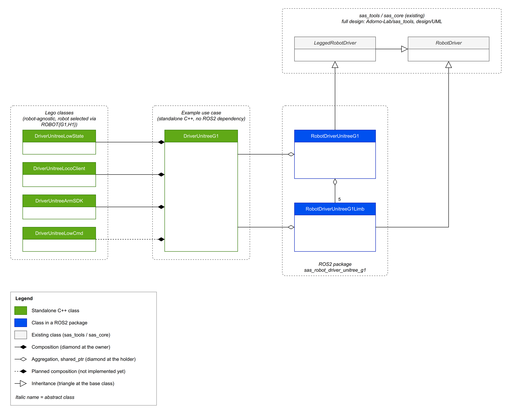

[](https://adorno-lab.github.io/unitree_drivers/)

# unitree_drivers

Robot-agnostic, pImpl-based C++ classes that wrap the Unitree SDK for locomotion, arm/waist control, low-level joint control, and state/IMU telemetry across Unitree's robot lineup. Reusable building blocks for higher-level drivers (per-robot facades or sas::RobotDriver implementations), not a complete driver itself.


# Install

> [!NOTE]
> Non-sudo privileges? Create a custom prefix folder (e.g. `~/opt`) to hold `lib/` and `include/` without needing root. See [this guide](https://ros2-tutorial.readthedocs.io/en/latest/cmake/cmake_packages_without_sudo.html) for background.

## Prerequisites

- [unitree_sdk2](https://github.com/unitreerobotics/unitree_sdk2) — build and install it first, following its own instructions.
- Eigen3 — `sudo apt install libeigen3-dev`
- [DQ Robotics](https://dqrobotics.github.io) — installed system-wide (e.g. via their apt PPA).
- [sas_cpp](https://github.com/MarinhoLab/sas_cpp)

If you're installing any of the above without sudo, install them to the same custom prefix `~/opt`, and see the non-sudo instructions for `unitree_drivers` itself.


## Sudo users

```shell
# 1. Configure: choose Release, and (optionally) where to install it.
#    Omit -DCMAKE_INSTALL_PREFIX to use the system default (/usr/local on Linux).
cmake -S . -B build \
    -DCMAKE_BUILD_TYPE=Release \
    -DCMAKE_INSTALL_PREFIX=/usr/local

# 2. Build the shared libraries.
cmake --build build -j$(nproc)

# 3. Install headers, libraries, and the exported CMake package.
sudo cmake --install build
```

## Non-sudo users

```shell
# 1. Configure: choose Release, and install to your own prefix instead of a system path.
cmake -S . -B build \
    -DCMAKE_BUILD_TYPE=Release \
    -DCMAKE_INSTALL_PREFIX=$HOME/opt

# 2. Build the shared libraries.
cmake --build build -j$(nproc)

# 3. Install headers, libraries, and the exported CMake package. No sudo needed.
cmake --install build
```

> [!TIP]
> If you skipped exporting `CMAKE_PREFIX_PATH` (along with `LD_LIBRARY_PATH`,
> `LIBRARY_PATH`, and `CPATH`) in `~/.bashrc` (see [this guide](https://ros2-tutorial.readthedocs.io/en/latest/cmake/cmake_packages_without_sudo.html)),
> any project that later does `find_package(unitree_drivers)` needs to be told
> where to look, since `$HOME/opt` isn't a default search path:
>
> ```shell
> cmake -S . -B build -DCMAKE_PREFIX_PATH=$HOME/opt
> ```


# Usage

```cmake
find_package(unitree_drivers REQUIRED)
target_link_libraries(${YOUR_LIBRARY} PRIVATE
     unitree_drivers::loco_client
     unitree_drivers::arm_sdk
     unitree_drivers::low_state)
```


```cpp
#include <unitree_drivers/DriverUnitreeLocoClient.h>
#include <unitree_drivers/DriverUnitreeArmSDK.h>
#include <unitree_drivers/DriverUnitreeLowState.h>
```

`DriverUnitreeArmSDK` drives the arms and waist through the `rt/arm_sdk` topic with a ramped blend weight, and supports both the G1 and the H1. Pick the robot at construction:

```cpp
using Arm = DriverUnitreeArmSDK;
Arm g1_arms(shutdown_signaler, Arm::ROBOT::G1);     // G1: 7 joints per arm, 3 waist joints
Arm h1_arms(shutdown_signaler, Arm::ROBOT::H1);     // H1: 4 joints per arm, 1 waist joint

h1_arms.connect();
h1_arms.initialize();
h1_arms.set_target_positions(Arm::LIMB::LEFT_ARM, {0.0, 0.3, 0.0, 0.5}); // size must be get_num_joints(LIMB)
h1_arms.enable_arm_control();
```

Default PD gains (kp / kd):

| | G1 | H1 |
|---|---|---|
| Shoulders, elbow | 80 / 3 | 60 / 1.5 |
| Wrists (roll, pitch, yaw) | 40 / 1.5 | — |
| Waist | 300 / 3 | 60 / 1.5 |

The G1 values are the ones Unitree uses for G1 teleoperation ([xr_teleoperate](https://github.com/unitreerobotics/xr_teleoperate/blob/main/teleop/robot_control/robot_arm.py)). The H1 values come from unitree_sdk2's `h1_arm_sdk_dds_example.cpp`.

You can change the gains per joint, one limb at a time, with `set_gains()`. You can call it while arm control is engaged: the published gains ramp toward the new values instead of jumping. For example, to make the G1 shoulders and elbows stiffer:
```cpp
g1_arms.set_gains(Arm::LIMB::LEFT_ARM, {150, 150, 150, 150, 40, 40, 40},  // kp: shoulder x3, elbow, wrist x3
                                       {2.4, 2.4, 2.4, 2.4, 1.5, 1.5, 1.5}); // kd
```

To give the H1 the gains Unitree uses for H1 teleoperation in [xr_teleoperate](https://github.com/unitreerobotics/xr_teleoperate/blob/main/teleop/robot_control/robot_arm.py) (`H1_ArmController`): 140 / 3 for the shoulders and elbow, and 300 / 5 for the waist.
```cpp
for (const auto limb : {Arm::LIMB::LEFT_ARM, Arm::LIMB::RIGHT_ARM})
    h1_arms.set_gains(limb, {140, 140, 140, 140},  // kp: ShoulderPitch, ShoulderRoll, ShoulderYaw, Elbow
                            {3, 3, 3, 3});         // kd
h1_arms.set_gains(Arm::LIMB::WAIST, {300}, {5});   // Yaw
```
> [!WARNING]
> xr_teleoperate sends these gains to the H1 on `rt/lowcmd`, not `rt/arm_sdk`. Unitree's only `rt/arm_sdk` reference for the H1 is the 60 / 1.5 example.

# Intended use in SAS driver classes



